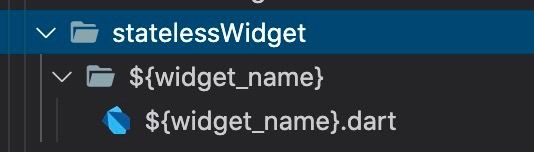

# Sloth

VSCode extension, allowing you to generate files from templates (with filling template values) and insert lines in existing files under some `tag`.

## Features

Define your templates like those in the example, write `config.json` like the one in the example and then use `Cmd + Shift + P` + `Run Sloth` to execute global command or Right Click -> `Run Sloth` to execute Local command.

## HOW TO

Firstly in the root of your project create folder `.vscode/sloth` and create there file `config.json`

This file has following structure:
```json
{
    "global": {
        "Global Shortcut 1": {
            "vars": [],
            "actions": []
        },
        "Global Shortcut 2": {
            "vars": [],
            "actions": []
        }
    },
    "local": {
        "Local Shortcut 1": {
            "vars": [],
            "actions": []
        },
        "Local Shortcut 2": {
            "vars": [],
            "actions": []
        }
    }
}
```

Each shortcut contains list of required variables and list of actions. In vars you list names of required variables for template. When template executes, extension will ask you for values of these variables. These variables may be used in templates as `${variableName}`. It can be used anywhere: folder name, file name, file contents.

Also Sloth will create for you aliases for each variable for `snake_case`, `PascalCase`, `camelCase` and `CONSTANT_CASE`.
For example you ask for variable `variableName` and pass value `bestExtension`, then these vars will be available for you in templates:
- `${variableName}` with value `bestExtension`
- `${VariableName}` with value `BestExtension`
- `${variable_name}` with value `best_extension`
- `${VARIABLE_NAME}` with value `BEST_EXTENSION`

Near your `config.json`, under the `sloth` directory put your templates with following structure: `.vscode/sloth/YOUR_TEMPLATE_NAME/files & folders to be copied`

### Global shortcuts

Global shortcuts are executing in the root of your project. They has 2 available actions:

#### create

```json
{
    "action": "create",
    "where": ["source", "ui", "screens"],
    "what": {
        "path": ["screen"]
    }
}
```

This actions will put contents of `screen` template in your `$PROJECT_ROOT/source/ui/screens/`

#### insert

Kind of strange feature allowing you to insert lines in existing files. Not recommended to use, but if really want, put `// @sloth YOUR_TAG` in your code where you want to insert lines. `YOUR_TAG` here is any string. Then add action in your config. For example:

```json
{
    "action": "insert",
    "where": ["source", "navigation", "navigator.dart"],
    "tasks": [
        {
            "what": "import 'package:project_name/src/ui/screens/${screenName}/${screenName}.dart'",
            "tag": "Screen import"
        }
    ]
}
```

This example will find `// @sloth Screen import` in `$PROJECT_ROOT/source/navigation/navigator.dart` and put `import 'package:project_name/src/ui/screens/${screenName}/${screenName}.dart'` under this line. `${screenName}` is value of variable `screenName` passed in vars

There can be multiple tasks for 1 file if you have multiple lines to insert.

### Local shortcuts

Local shortcuts support only `create` action, so you need to specify only template to use 

```json
{
    "what": {
        "path": ["templateName"]
    }
}
```

Then right click on any folder in your project structure and run Sloth. It will create files from your template under chosen directory

## Bonus for flutter devs

In Dart files for selected text there is a new option `New Widget...`. To use it, create template `statelessWidget` under `.vscode/sloth` directory. It's not necessary to add it in `config.json`. To create this template you can use following variables: `widget_name`, `WidgetName`, `widgetName`, `WIDGET_NAME`.

Example:



```dart
import 'package:flutter/widgets.dart';

class ${WidgetName} extends StatelessWidget {
  const ${WidgetName}({
    Key key,
  }) : super(key: key);

  @override
  Widget build(BuildContext context) {
    return Container();
  }
}
```


## Installation

Download file `product/sloth-x.x.x.vsix`, run in terminal

```sh
code --install-extension sloth-x.x.x.vsix
```

## Build

To build an extension

```sh
npm install -g vsce
vsce package
```

## TODO
- Support for multiple projects in workspace
